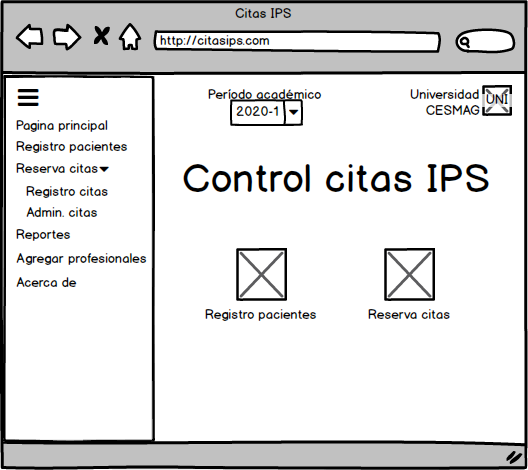
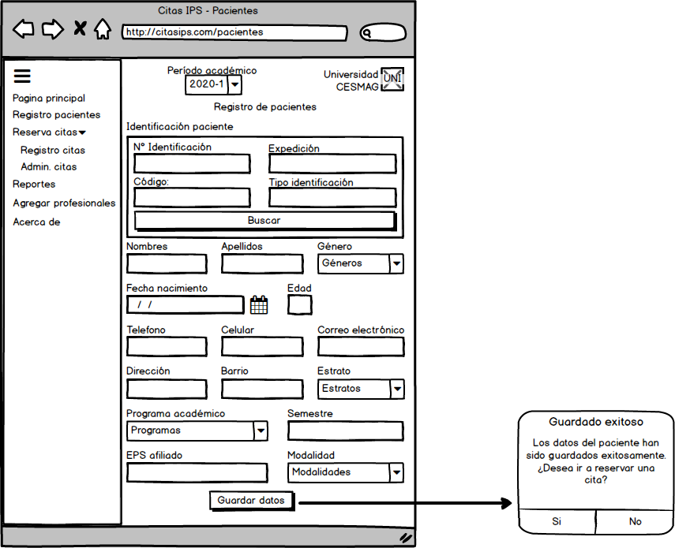
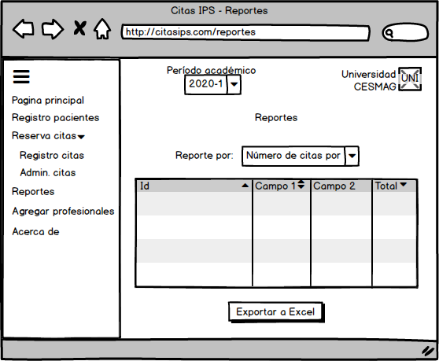
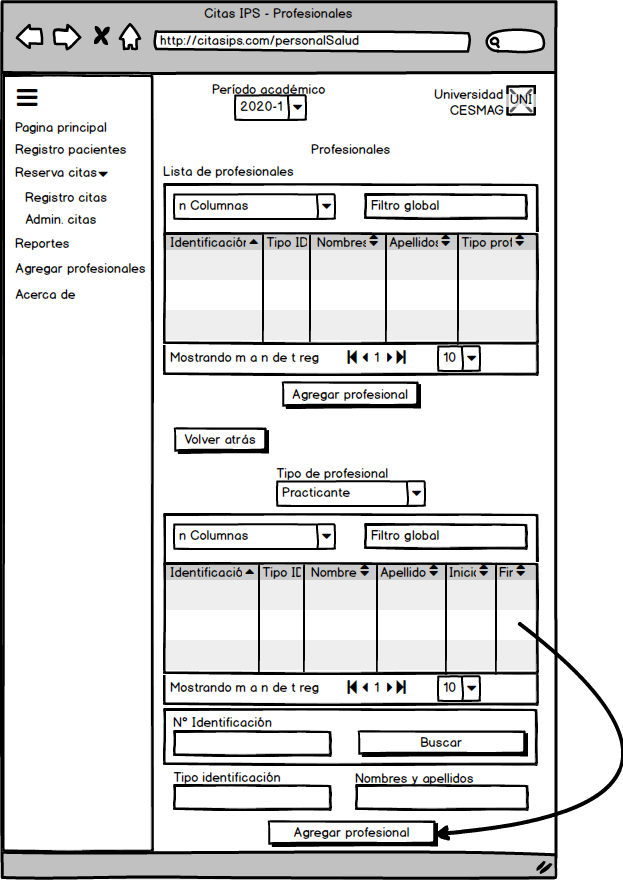

# CitasIPS
Aplicación web desarrollada en Angular y Symfony con el fin de administrar citas psicológicas para la Unidad de Salud de la Universidad CESMAG.
 
 
 
 
 

Menú principal.
 
 
 

Registro de pacientes.
 
 
 

Registro de citas.
 
 
 

Administración de citas.
 
 
 

Generación de reportes.

 
 
 

Visualización y registro de profesionales de salud.
